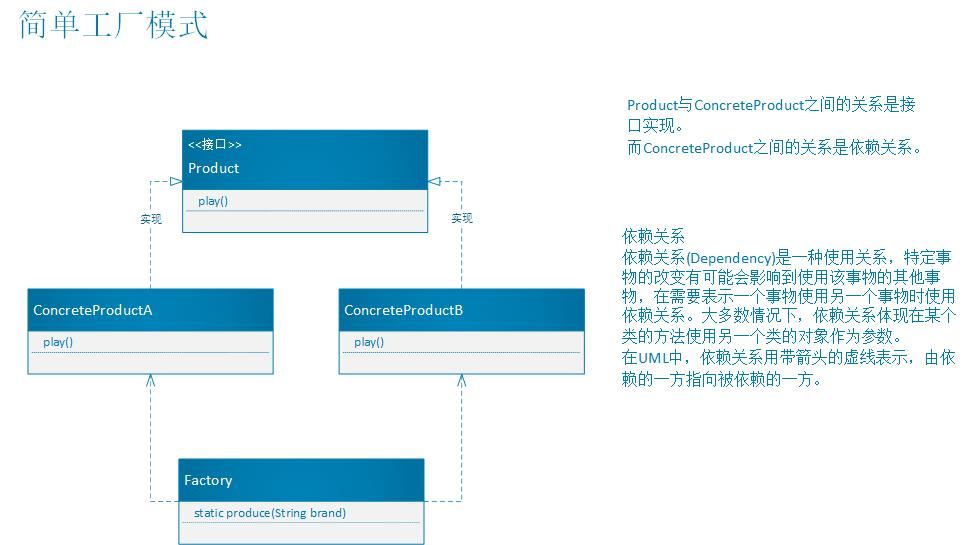
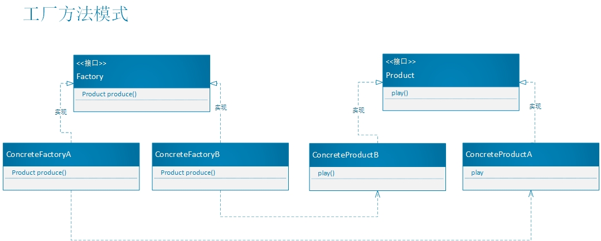

创建型模式(Creational Pattern)对类的实例化过程进行了抽象，能够将软件模块中对象的创建和对象的使用分离。为了使软件的结构更加清晰，外界对于这些对象只需要知道它们共同的接口，而不清楚其具体的实现细节，使整个系统的设计更加符合单一职责原则。

创建型模式在创建什么(What)，由谁创建(Who)，何时创建(When)等方面都为软件设计者提供了尽可能大的灵活性。创建型模式隐藏了类的实例的创建细节，通过隐藏对象如何被创建和组合在一起达到使整个系统独立的目的。 

* 简单工厂模式 Simple Factory
* 工厂方法模式 Factory Method
* 抽象工厂模式 Abstract Factory
三个工厂有啥区别和联系呢？我们肯定是需要去总结的。

### 工厂模式总结

* 建造者模式 Builder
* 原型模式 Prototype
* 单例模式 Singleton
