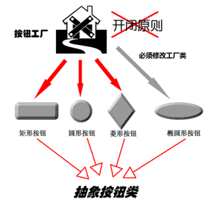
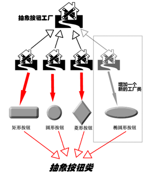
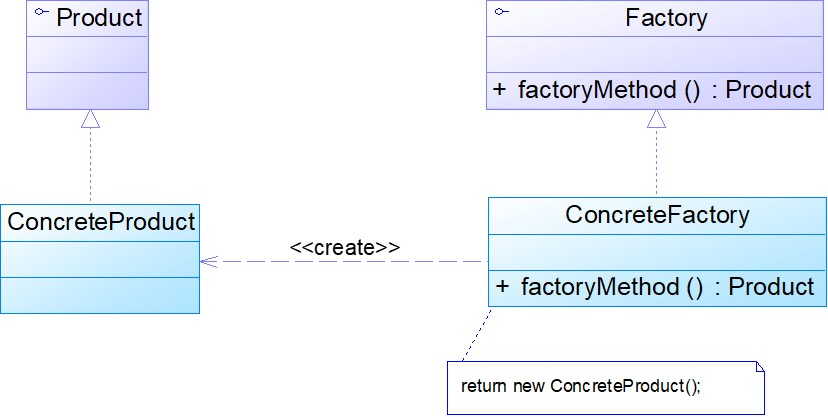
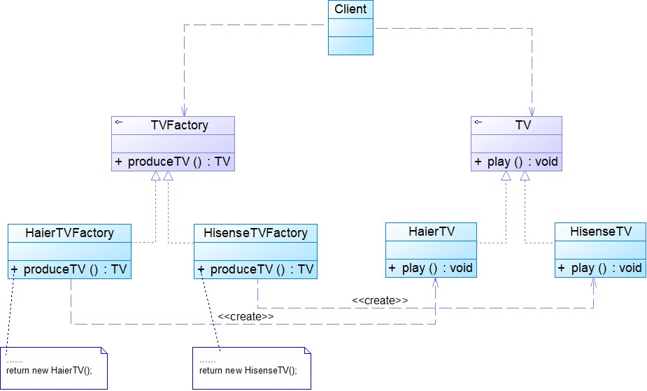
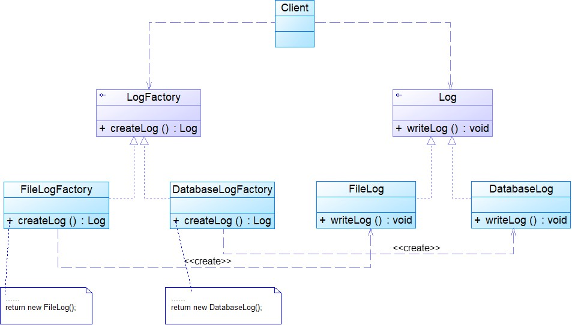
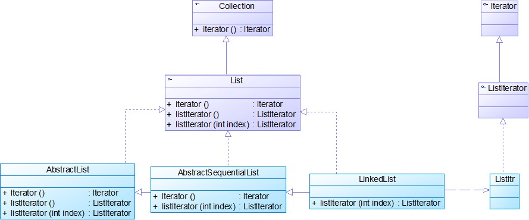

# 工厂方法模式

### 模式动机与定义
简单工厂模式的不足
在简单工厂模式中，只提供了一个工厂类，该工厂类处于对产品类进行实例化的中心位置，它知道每一个产品对象的创建细节，并决定何时实例化哪一个产品类。简单工厂模式最大的缺点是当有新产品要加入到系统中时，必须修改工厂类，加入必要的处理逻辑，这违背了“开闭原则”。在简单工厂模式中，所有的产品都是由同一个工厂创建，工厂类职责较重，业务逻辑较为复杂，具体产品与工厂类之间的耦合度高，严重影响了系统的灵活性和扩展性，而工厂方法模式则可以很好地解决这一问题。

#### 模式动机
考虑这样一个系统，按钮工厂类可以返回一个具体的按钮实例，如圆形按钮、矩形按钮、菱形按钮等。在这个系统中，如果需要增加一种新类型的按钮，如椭圆形按钮，那么除了增加一个新的具体产品类之外，还需要修改工厂类的代码，这就使得整个设计在一定程度上违反了“开闭原则”。 


现在对该系统进行修改，不再设计一个按钮工厂类来统一负责所有产品的创建，而是将具体按钮的创建过程交给专门的工厂子类去完成，我们先定义一个抽象的按钮工厂类，再定义具体的工厂类来生成圆形按钮、矩形按钮、菱形按钮等，它们实现在抽象按钮工厂类中定义的方法。这种抽象化的结果使这种结构可以在不修改具体工厂类的情况下引进新的产品，如果出现新的按钮类型，只需要为这种新类型的按钮创建一个具体的工厂类就可以获得该新按钮的实例，这一特点无疑使得工厂方法模式具有超越简单工厂模式的优越性，更加符合“开闭原则”。

使用工厂方法模式设计的按钮工厂


#### 模式定义
工厂方法模式(Factory Method Pattern)又称为工厂模式，也叫虚拟构造器(Virtual Constructor)模式或者多态工厂(Polymorphic Factory)模式，它属于类创建型模式。在工厂方法模式中，工厂父类负责定义创建产品对象的公共接口，而工厂子类则负责生成具体的产品对象，这样做的目的是将产品类的实例化操作延迟到工厂子类中完成，即通过工厂子类来确定究竟应该实例化哪一个具体产品类。

Factory Method Pattern: Define an interface for creating an object, but let subclasses decide which class to instantiate. Factory Method lets a class defer instantiation to subclasses. 


Frequency of use: high 

### 模式结构与分析
#### 模式结构


工厂方法模式包含如下角色：
* Product：抽象产品
* ConcreteProduct：具体产品
* Factory：抽象工厂
* ConcreteFactory：具体工厂
#### 模式分析
工厂方法模式是简单工厂模式的进一步抽象和推广。由于使用了面向对象的多态性，工厂方法模式保持了简单工厂模式的优点，而且克服了它的缺点。在工厂方法模式中，核心的工厂类不再负责所有产品的创建，而是将具体创建工作交给子类去做。这个核心类仅仅负责给出具体工厂必须实现的接口，而不负责哪一个产品类被实例化这种细节，这使得工厂方法模式可以允许系统在不修改工厂角色的情况下引进新产品。 

当系统扩展需要添加新的产品对象时，仅仅需要添加一个具体产品对象以及一个具体工厂对象，原有工厂对象不需要进行任何修改，也不需要修改客户端，很好地符合了“开闭原则”。而简单工厂模式在添加新产品对象后不得不修改工厂方法，扩展性不好。工厂方法模式退化后可以演变成简单工厂模式。

抽象工厂类代码：
```java
public abstract class PayMethodFactory
{
    public abstract AbstractPay getPayMethod();
}

```
具体工厂类代码：
```java
public class CashPayFactory extends PayMethodFactory
{
    public AbstractPay getPayMethod()
    {
        return new CashPay();
    }
} 
```
客户类代码片段：
```java
PayMethodFactory factory;
AbstractPay payMethod;
factory=new CashPayFactory();
payMethod =factory.getPayMethod();
payMethod.pay(); 
```
为了提高系统的可扩展性和灵活性，在定义工厂和产品时都必须使用抽象层，如果需要更换产品类，只需要更换对应的工厂即可，其他代码不需要进行任何修改。 

配置文件代码：
* 在实际的应用开发中，一般将具体工厂类的实例化过程进行改进，不直接使用new关键字来创建对象，而是将具体类的类名写入配置文件中，再通过Java的反射机制，读取XML格式的配置文件，根据存储在XML文件中的类名字符串生成对象。 
```xml
<?xml version="1.0"?>
<config>
	<className>CashPayFactory</className>
</config> 
```
Java反射(Java Reflection)：
* 是指在程序运行时获取已知名称的类或已有对象的相关信息的一种机制，包括类的方法、属性、超类等信息，还包括实例的创建和实例类型的判断等。可通过Class类的forName()方法返回与带有给定字符串名的类或接口相关联的Class对象，再通过newInstance()方法创建此对象所表示的类的一个新实例，即通过一个类名字符串得到类的实例。 
```java
//创建一个字符串类型的对象
Class c = Class.forName(“String”);
Object obj = c.newInstance();
return obj;
```
工具类XMLUtil代码片段：
```java
//创建DOM文档对象
DocumentBuilderFactory dFactory = DocumentBuilderFactory.newInstance();
DocumentBuilder builder = dFactory.newDocumentBuilder();
Document doc;							
doc = builder.parse(new File("config.xml")); 
    
 //获取包含类名的文本节点
NodeList nl = doc.getElementsByTagName("className");
Node classNode=nl.item(0).getFirstChild();
String cName=classNode.getNodeValue();

//通过类名生成实例对象并将其返回
Class c=Class.forName(cName);
Object obj=c.newInstance();
return obj;
```
修改后的客户类代码片段：
```java
PayMethodFactory factory;
AbstractPay payMethod;
factory=(PayMethodFactory)XMLUtil.getBean();
//getBean()的返回类型为Object，此处需要进行强制类型转换
payMethod =factory.getPayMethod();
payMethod.pay(); 
```
### 模式实例与解析
#### 实例一：电视机工厂【代码】
将原有的工厂进行分割，为每种品牌的电视机提供一个子工厂，海尔工厂专门负责生产海尔电视机，海信工厂专门负责生产海信电视机，如果需要生产TCL电视机或创维电视机，只需要对应增加一个新的TCL工厂或创维工厂即可，原有的工厂无须做任何修改，使得整个系统具有更加的灵活性和可扩展性。 

#### 实例二：日志记录器【代码】
某系统日志记录器要求支持多种日志记录方式，如文件记录、数据库记录等，且用户可以根据要求动态选择日志记录方式，现使用工厂方法模式设计该系统。


#### 模式优缺点
工厂方法模式的优点
* 在工厂方法模式中，工厂方法用来创建客户所需要的产品，同时还向客户隐藏了哪种具体产品类将被实例化这一细节，用户只需要关心所需产品对应的工厂，无须关心创建细节，甚至无须知道具体产品类的类名。
基于工厂角色和产品角色的多态性设计是工厂方法模式的关键。它能够使工厂可以自主确定创建何种产品对象，而如何创建这个对象的细节则完全封装在具体工厂内部。工厂方法模式之所以又被称为多态工厂模式，是因为所有的具体工厂类都具有同一抽象父类。
使用工厂方法模式的另一个优点是在系统中加入新产品时，无须修改抽象工厂和抽象产品提供的接口，无须修改客户端，也无须修改其他的具体工厂和具体产品，而只要添加一个具体工厂和具体产品就可以了。这样，系统的可扩展性也就变得非常好，完全符合“开闭原则”。

工厂方法模式的缺点
* 在添加新产品时，需要编写新的具体产品类，而且还要提供与之对应的具体工厂类，系统中类的个数将成对增加，在一定程度上增加了系统的复杂度，有更多的类需要编译和运行，会给系统带来一些额外的开销。
由于考虑到系统的可扩展性，需要引入抽象层，在客户端代码中均使用抽象层进行定义，增加了系统的抽象性和理解难度，且在实现时可能需要用到DOM、反射等技术，增加了系统的实现难度。

#### 模式适用环境
在以下情况下可以使用工厂方法模式：
* 一个类不知道它所需要的对象的类：在工厂方法模式中，客户端不需要知道具体产品类的类名，只需要知道所对应的工厂即可，具体的产品对象由具体工厂类创建；客户端需要知道创建具体产品的工厂类。
* 一个类通过其子类来指定创建哪个对象：在工厂方法模式中，对于抽象工厂类只需要提供一个创建产品的接口，而由其子类来确定具体要创建的对象，利用面向对象的多态性和里氏代换原则，在程序运行时，子类对象将覆盖父类对象，从而使得系统更容易扩展。
* 将创建对象的任务委托给多个工厂子类中的某一个，客户端在使用时可以无须关心是哪一个工厂子类创建产品子类，需要时再动态指定，可将具体工厂类的类名存储在配置文件或数据库中。
### 模式效果与应用
#### 模式应用
(1) java.util.Collection接口的iterator()方法： 

(2) Java消息服务JMS(Java Messaging Service) ：
```java
//使用上下文和JNDI得到连接工厂的引用，ctx是上下文Context类型的对象
QueueConnectionFactory qConnFact=(QueueConnectionFactory)ctx.lookup("cfJndi");
//使用连接工厂创建一个连接
QueueConnection qConn=qConnFact.createQueueConnection();
//使用连接创建一个会话
QueueSession qSess=qConn.createQueueSession(false,javax.jms.QueueSession. AUTO_ACKNOWLEDGE);
//使用上下文和JNDI得到消息队列的引用
Queue q=(Queue)ctx.lookup("myQueue");
//使用连接创建一个需要发送的消息类型的实例
QueueSender qSend=qSess.createSender(q);
System.out.println("开始发送消息......"); 
```
(3) JDBC中的工厂方法：
```java
Connection conn=DriverManager.getConnection("jdbc:microsoft:sqlserver://localhost:1433; DatabaseName=DB;user=sa;password=");
Statement statement=conn.createStatement();
ResultSet rs=statement.executeQuery("select * from UserInfo");
```


### 模式扩展

* 使用多个工厂方法：在抽象工厂角色中可以定义多个工厂方法，从而使具体工厂角色实现这些不同的工厂方法，这些方法可以包含不同的业务逻辑，以满足对不同的产品对象的需求。
* 产品对象的重复使用：工厂对象将已经创建过的产品保存到一个集合（如数组、List等）中，然后根据客户对产品的请求，对集合进行查询。如果有满足要求的产品对象，就直接将该产品返回客户端；如果集合中没有这样的产品对象，那么就创建一个新的满足要求的产品对象，然后将这个对象在增加到集合中，再返回给客户端。 
* 多态性的丧失和模式的退化：如果工厂仅仅返回一个具体产品对象，便违背了工厂方法的用意，发生退化，此时就不再是工厂方法模式了。一般来说，工厂对象应当有一个抽象的父类型，如果工厂等级结构中只有一个具体工厂类的话，抽象工厂就可以省略，也将发生了退化。当只有一个具体工厂，在具体工厂中可以创建所有的产品对象，并且工厂方法设计为静态方法时，工厂方法模式就退化成简单工厂模式。 

### 本章小结
* 工厂方法模式又称为工厂模式，它属于类创建型模式。在工厂方法模式中，工厂父类负责定义创建产品对象的公共接口，而工厂子类则负责生成具体的产品对象，这样做的目的是将产品类的实例化操作延迟到工厂子类中完成，即通过工厂子类来确定究竟应该实例化哪一个具体产品类。
* 工厂方法模式包含四个角色：抽象产品是定义产品的接口，是工厂方法模式所创建对象的超类型，即产品对象的共同父类或接口；具体产品实现了抽象产品接口，某种类型的具体产品由专门的具体工厂创建，它们之间往往一一对应；抽象工厂中声明了工厂方法，用于返回一个产品，它是工厂方法模式的核心，任何在模式中创建对象的工厂类都必须实现该接口；具体工厂是抽象工厂类的子类，实现了抽象工厂中定义的工厂方法，并可由客户调用，返回一个具体产品类的实例。 
* 工厂方法模式是简单工厂模式的进一步抽象和推广。由于使用了面向对象的多态性，工厂方法模式保持了简单工厂模式的优点，而且克服了它的缺点。在工厂方法模式中，核心的工厂类不再负责所有产品的创建，而是将具体创建工作交给子类去做。这个核心类仅仅负责给出具体工厂必须实现的接口，而不负责产品类被实例化这种细节，这使得工厂方法模式可以允许系统在不修改工厂角色的情况下引进新产品。 
* 工厂方法模式的主要优点是增加新的产品类时无须修改现有系统，并封装了产品对象的创建细节，系统具有良好的灵活性和可扩展性；其缺点在于增加新产品的同时需要增加新的工厂，导致系统类的个数成对增加，在一定程度上增加了系统的复杂性。 
* 工厂方法模式适用情况包括：一个类不知道它所需要的对象的类；一个类通过其子类来指定创建哪个对象；将创建对象的任务委托给多个工厂子类中的某一个，客户端在使用时可以无须关心是哪一个工厂子类创建产品子类，需要时再动态指定。
