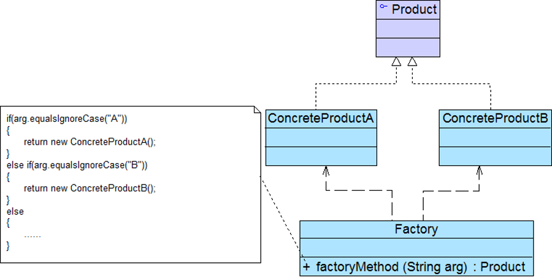
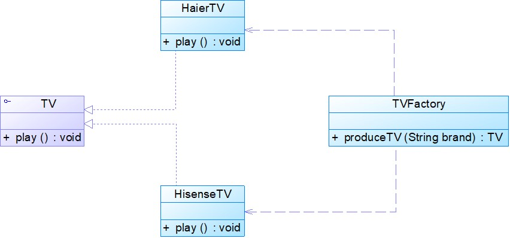
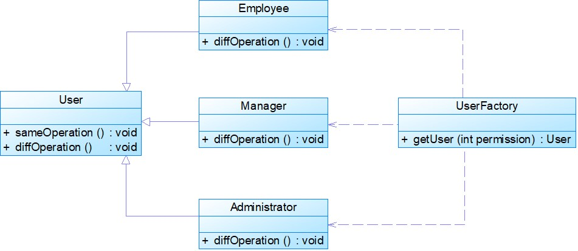
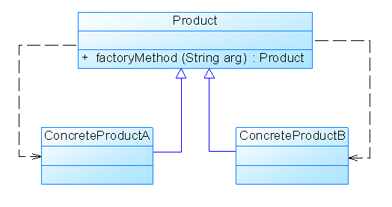

### 模式动机
考虑一个简单的软件应用场景，一个软件系统可以提供多个外观不同的按钮（如圆形按钮、矩形按钮、菱形按钮等），这些按钮都源自同一个基类，不过在继承基类后不同的子类修改了部分属性从而使得它们可以呈现不同的外观，如果我们希望在使用这些按钮时，不需要知道这些具体按钮类的名字，只需要知道表示该按钮类的一个参数，并提供一个调用方便的方法，把该参数传入方法即可返回一个相应的按钮对象，此时，就可以使用简单工厂模式。
### 模式定义
简单工厂模式(Simple Factory Pattern)：又称为静态工厂方法(Static Factory Method)模式，它属于类创建型模式。在简单工厂模式中，可以根据参数的不同返回不同类的实例。简单工厂模式专门定义一个类来负责创建其他类的实例，被创建的实例通常都具有共同的父类。 


### 模式结构
简单工厂模式包含如下角色：
* Factory：工厂角色
* Product：抽象产品角色
* ConcreteProduct：具体产品角色

### 模式分析
将对象的创建和对象本身业务处理分离可以降低系统的耦合度，使得两者修改起来都相对容易。 
在调用工厂类的工厂方法时，由于工厂方法是静态方法，使用起来很方便，可通过类名直接调用，而且只需要传入一个简单的参数即可，在实际开发中，还可以在调用时将所传入的参数保存在XML等格式的配置文件中，修改参数时无须修改任何Java源代码。
简单工厂模式最大的问题在于工厂类的职责相对过重，增加新的产品需要修改工厂类的判断逻辑，这一点与开闭原则是相违背的。
简单工厂模式的要点在于：当你需要什么，只需要传入一个正确的参数，就可以获取你所需要的对象，而无须知道其创建细节。  

### 模式实例与解析
#### 实例一：简单电视机工厂
某电视机厂专为各知名电视机品牌代工生产各类电视机，当需要海尔牌电视机时只需要在调用该工厂的工厂方法时传入参数“Haier”，需要海信电视机时只需要传入参数“Hisense”，工厂可以根据传入的不同参数返回不同品牌的电视机。现使用简单工厂模式来模拟该电视机工厂的生产过程。


#### 实例二：权限管理
在某OA系统中，系统根据对比用户在登录时输入的账号和密码以及在数据库中存储的账号和密码是否一致来进行身份验证，如果验证通过，则取出存储在数据库中的用户权限等级（以整数形式存储），根据不同的权限等级创建不同等级的用户对象，不同等级的用户对象拥有不同的操作权限。现使用简单工厂模式来设计该权限管理模块。



### 模式优缺点

#### 简单工厂模式的优点
工厂类含有必要的判断逻辑，可以决定在什么时候创建哪一个产品类的实例，客户端可以免除直接创建产品对象的责任，而仅仅“消费”产品；简单工厂模式通过这种做法实现了对责任的分割，它提供了专门的工厂类用于创建对象。
客户端无须知道所创建的具体产品类的类名，只需要知道具体产品类所对应的参数即可，对于一些复杂的类名，通过简单工厂模式可以减少使用者的记忆量。
通过引入配置文件，可以在不修改任何客户端代码的情况下更换和增加新的具体产品类，在一定程度上提高了系统的灵活性。

#### 简单工厂模式的缺点
由于工厂类集中了所有产品创建逻辑，一旦不能正常工作，整个系统都要受到影响。
使用简单工厂模式将会增加系统中类的个数，在一定程序上增加了系统的复杂度和理解难度。
系统扩展困难，一旦添加新产品就不得不修改工厂逻辑，在产品类型较多时，有可能造成工厂逻辑过于复杂，不利于系统的扩展和维护。
简单工厂模式由于使用了静态工厂方法，造成工厂角色无法形成基于继承的等级结构。

### 模式适用环境
#### 在以下情况下可以使用简单工厂模式：
工厂类负责创建的对象比较少：由于创建的对象较少，不会造成工厂方法中的业务逻辑太过复杂。
客户端只知道传入工厂类的参数，对于如何创建对象不关心：客户端既不需要关心创建细节，甚至连类名都不需要记住，只需要知道类型所对应的参数。

###模式应用
(1) 在JDK类库中广泛使用了简单工厂模式，如工具类java.text.DateFormat，它用于格式化一个本地日期或者时间。
```java
public final static DateFormat getDateInstance();
public final static DateFormat getDateInstance(int style);
public final static DateFormat getDateInstance(int style,Locale locale);
```
(2) Java加密技术 DESEncrypt.java
```java
//获取不同加密算法的密钥生成器
KeyGenerator keyGen=KeyGenerator.getInstance("DESede");
//创建密码器
Cipher cp=Cipher.getInstance("DESede");
```
### 模式扩展
简单工厂模式的简化：
在有些情况下工厂类可以由抽象产品角色扮演，一个抽象产品类同时也是子类的工厂，也就是说把静态工厂方法写到抽象产品类中。

### 本章小结
* 创建型模式对类的实例化过程进行了抽象，能够将对象的创建与对象的使用过程分离。
* 简单工厂模式又称为静态工厂方法模式，它属于类创建型模式。在简单工厂模式中，可以根据参数的不同返回不同类的实例。简单工厂模式专门定义一个类来负责创建其他类的实例，被创建的实例通常都具有共同的父类。
* 简单工厂模式包含三个角色：工厂角色负责实现创建所有实例的内部逻辑；抽象产品角色是所创建的所有对象的父类，负责描述所有实例所共有的公共接口；具体产品角色是创建目标，所有创建的对象都充当这个角色的某个具体类的实例。
